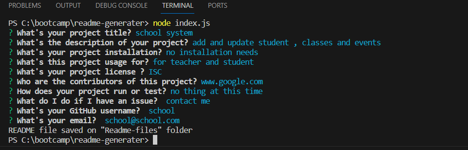
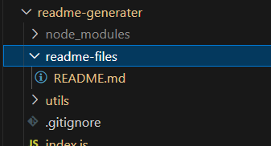
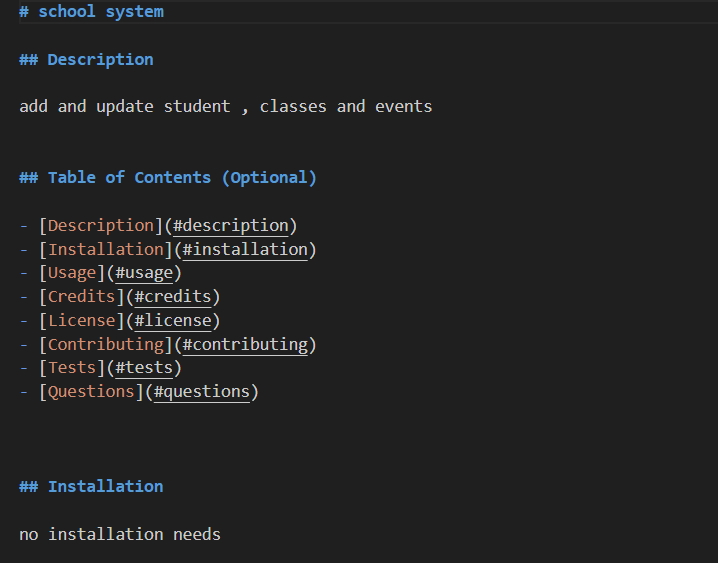
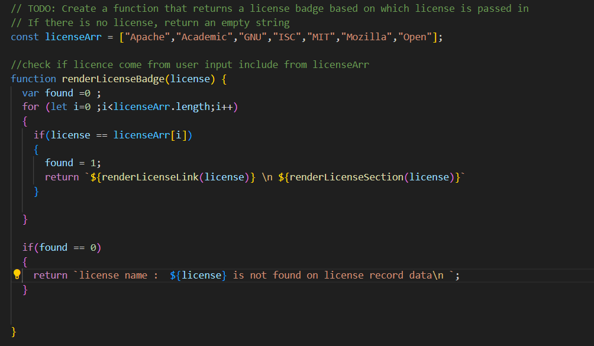
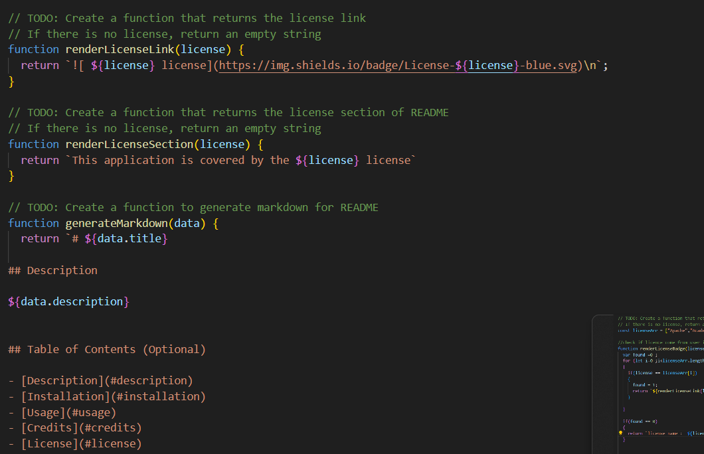
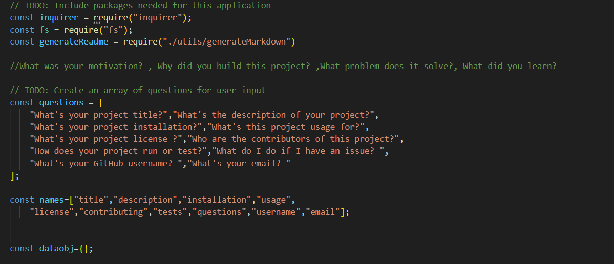
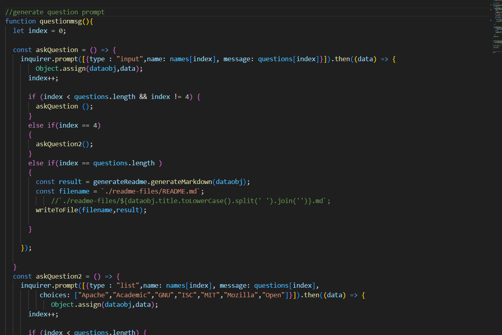
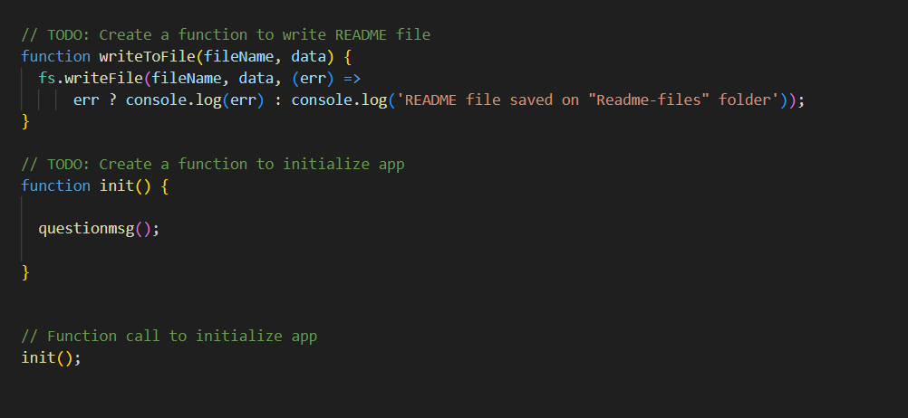

# readme-generater

## Description

I learn alot from NodeJS and how to work with Back-End (server side) ,I build this project to generate new README.md file

- What problem does it solve?
1- I solved many problems like: read the question from array and then generate prompt question for each question and take the user input then add it to the readme high-quality professional README.md section entitled
2- the question include, title of the project, Description, Installation, Usage, License, Contributing, Tests, and Questions
3- add Table of contents with link for each title
4- create a question license list , when user check one of the license , then the value will go to another function to make sure it's part from the list license , if it's include will generate license bagde and section
5- add some information about question if there are some issue with project, github account and email address 
6- I have one issue but it's not effect the challege , it's how to generate a question prompt from the question array because each prompt need "name,type,question" so my project has two array question and name but I have to find solution for the type without using if-statment alot.

## Installation

the project has two installation process one for (package.json) and it's install using this command in terminal "npm init"
another process is (node_modules) and it's install using this command in terminal "npm install inquerer@8.2.4"

## Usage
run the project from the terminal and write "node index.js", if the project doesn't show the question starting generated that mean we have to install two package (package.json , node_modules)
after the question generate will save the project question values information to high-quality professional README.md 

github : https://github.com/omeraus6/readme-generater

image 1: Question input come from generate function question and the question save on arrat

image 2: Readme-files folders

image 3: Part from README.md generate

image 4: function check if the license array if it same as the user input

image 5: generate README function

image 6: question and names array 

image 7: this function generate question prompt from question and names array.
          dataobj is an object variable collect the data value from user

image 8: Save file function

video: show the project run

## Credits

Thank you for tips and sugestion from Bootcamp instructors and classmates, I hava used https://www.w3schools.com/ , https://stackoverflow.com/ and https://developer.mozilla.org/en-US/docs/Web/CSS/grid-template to reserch information 

## License

Please refer to the LICENSE in the repo.